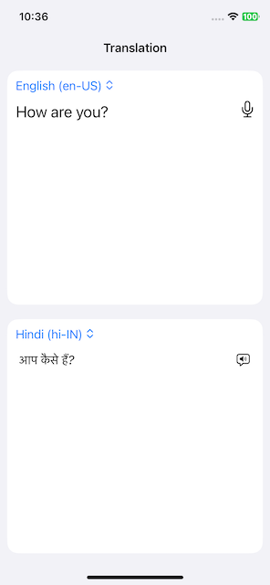

🌎 Language Translator App (SwiftUI)
---------
This project is a SwiftUI-based application that translates spoken or typed text between different languages using Apple's Translation framework.
It supports both voice input and voice output, providing a smooth and fast multilingual experience.

✨ Features
---------
* 🎙️ Speech-to-Text: Speak in one language and get it converted to text automatically.
* 🌐 Real-time Translation: Translate input text into the selected target language instantly.
* 🔊 Text-to-Speech: Listen to the translated output in the correct voice and accent.
* 🗂️ Language Picker: Choose source and target languages from a dynamic list.
* 🕒 Debounced Input: Smartly delays translation to avoid unnecessary requests while typing.
* 🎛️ Adaptive Audio Session: Automatically configures audio session for recording and playback modes.
* 📴 Offline Mode Support: Once required languages are downloaded, translation and recognition work without an internet connection.

🧩 Upcoming Features / Improvements
---------
* 🔄 Dynamic Source Language Switching:
Resolve the issue where changing the source language at runtime does not properly update the speech recognition or translation context.
➤ Example: When switching from English to Arabic, It may trigger a language download prompt instead of recognizing and displaying text in the correct script.

* 🌐 Improved Language Context Handling:
Improve the behavior when changing the source language at runtime. Currently, switching the language (e.g., from English to Hindi) does not fully update the recognition context.
➤ Example: If Hindi is selected as the source language and the user speaks in Hindi, the recognized text still appears in English instead of Hindi script.

🛠 Tech Stack
---------
* SwiftUI - Modern UI building
* Translation Framework - Built-in Apple translation services
* Combine - Managing asynchronous text changes
* AVFoundation - Handling speech recognition and text-to-speech
* UIKit (minor) - Managing AVAudioSession

🚀 Getting Started
---------
1. Clone the repository: 
    git clone https://github.com/PSSPL-Mobile/Language-Translate.git
2. Open the project in Xcode 15 or above.
3. Make sure you enable the following entitlements in your .plist file:
    * NSMicrophoneUsageDescription → Microphone access for speech-to-text
    * NSSpeechRecognitionUsageDescription → Speech recognition access
4. Build and run on a real device (not Simulator) for full Speech recognition.

📦 Requirements & Setup Notes
---------
* 📶 Offline Usage:
This app supports offline translation, but languages must first be downloaded.
When selecting a new source or target language for the first time, iOS may prompt you to download that language.
➤ Once downloaded, translations and recognition for that language will work without internet access.

* ⌨️ Keyboard Setup for Input:
To enable typing in your selected source language:
→ Go to Settings → General → Keyboard → Keyboards → Add New Keyboard, then select the desired language.

📖 Usage
---------
1. Select the source language (the language you will type or speak).
2. Select the target language (the language you want to translate into).
3. Start speaking using the 🎤 microphone button or manually enter text.
4. View the translated text instantly below.
5. Tap the 🔈 speaker button to hear the translation spoken aloud.

🖼️ Screenshots
---------

